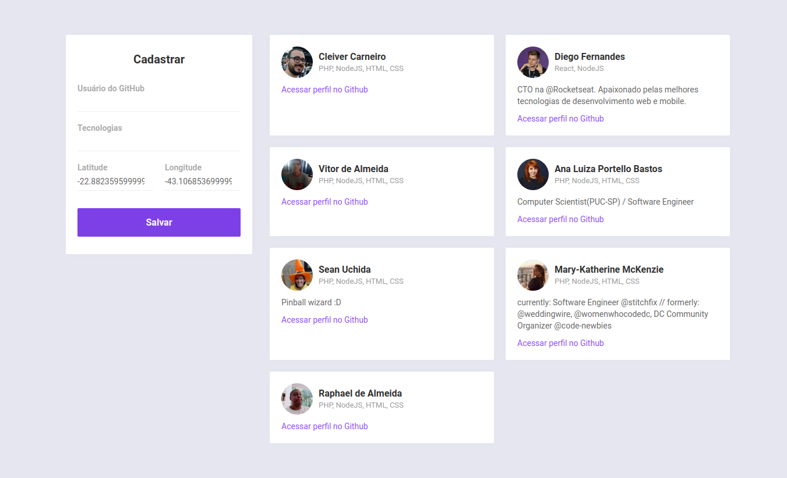
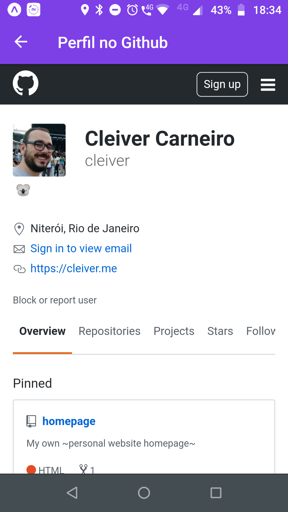

<h1 align="center">
  Semana OmniStack 10
</h1>
<h2 align="center">
    
</h2>

<p align="center">
  

  


  
</p>

## 💼 Project

DevRadar is a project that aims to connect developers near you that work with the same technologies.

## 🤔 Semana OmniStack?
OmniStack week is an online event by [Rocketseat](https://rocketseat.com.br) where we develop an whole application from scratch in a week.

## 🤓 Technologies

This project was developed using:

- [Node.js](https://nodejs.org/en/)
- [MongoDB](https://www.mongodb.com)
- [React](https://reactjs.org)
- [React Native](https://facebook.github.io/react-native/)
- [Expo](https://expo.io/)

## 📷 Screenshots





## 📋 Probable Roadmap
- host somewhere
- pre-load from github?

## 💻 Development Environment

To make things easier and cleaner, I keep my program languages installed locally but the services I need I use with Docker.

### Database

For this project I used the official Mongo release available at [Docker Hub](https://hub.docker.com/_/mongo).

```
docker run --name mongosrv -v /var/dev/mongo:/data/db -p 27017:27017 -d mongo
```

### Back-end

You need to run the backend application to use the web and mobile interface.

```
$ cd backend
$ yarn
$ yarn dev
```

### Web
```
$ cd web
$ yarn
$ yarn start
```

### Mobile
The mobile app was developed using expo, so it should be easy to run the app in your smartphone
```
$ cd mobile
$ yarn
$ yarn start
```